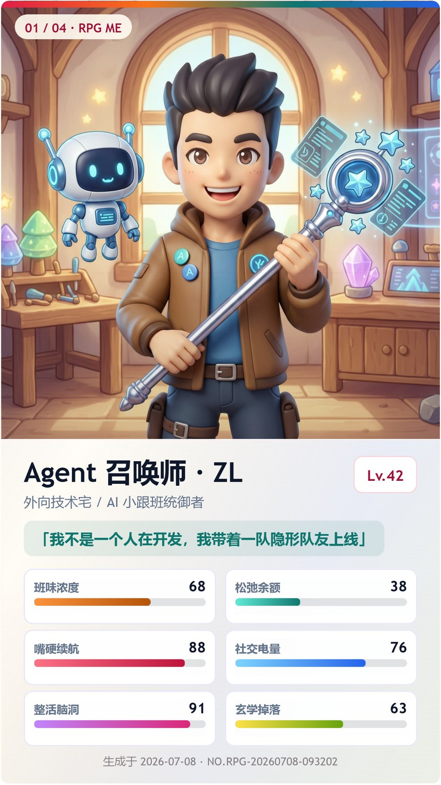
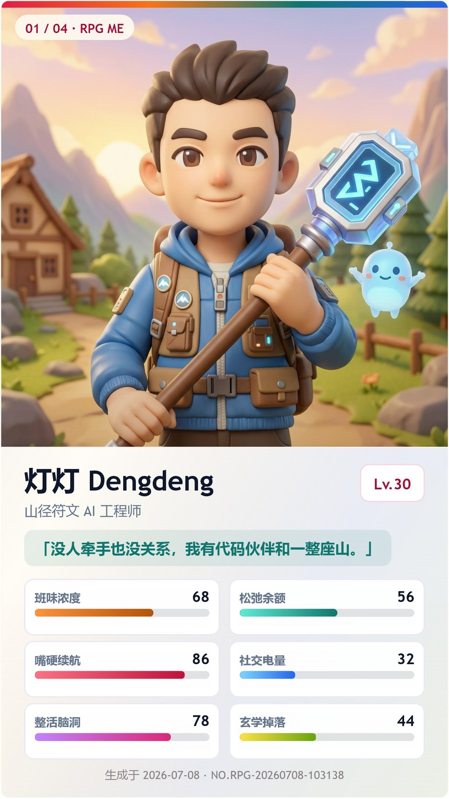

# rpg-me

把一句“最近的状态”变成一套可晒、可下载、可回看的 **人生游戏 RPG 角色卡**。

`rpg-me` 是一个 Agent Skill：它会用低门槛的三轮选择题收集信息，把用户的职业感、生活状态、成长方向和回血来源，翻译成明亮童话 JRPG 风格的角色设定、立绘、属性面板、技能和任务卡。

<p align="center">
  
  
  
</p>

## 它能生成什么

- 4 张 9:16 分享卡：封面、角色解析、RPG 面板、技能任务。
- 1 张 1:1 角色立绘：默认走阿里云百炼生图接口。
- 6 个反差属性：班味浓度、松弛余额、嘴硬续航、社交电量、整活脑洞、玄学掉落。
- 不设 100 上限的 RPG 数值：力量、敏捷、智力、HP、MP、EXP。
- 本地历史查看器：每次生成都会保存到 `output/history/`，可以用浏览器回看和下载 PNG。

## 为什么好玩

很多“AI 头像生成器”只会问你一大段设定。`rpg-me` 反过来做：先让用户在三张 Markdown 表格里选编号，不用组织长文，也能生成有梗、有反差、适合小红书轮播的角色卡。

默认流程是：

1. 你现在更像哪种人？
2. 你最近最想在哪方面升级？
3. 什么东西最能给你回血或加 buff？

三题答完后，用户可以选择跳过精细信息，也可以补充职业、年龄、性别呈现、外观要求和不想要的元素。

示例回复：

```text
第 1 题：A3
第 2 题：D2
第 3 题：A1
精细信息：B
职业/身份：AI Agent 独立开发
年龄或年龄段：80后
性别或角色呈现：男
外观要求：外向技术宅，有 AI 小跟班
```

## 环境要求

- Python：必须有本机 Python 环境。
- 推荐版本：Python 3.10 或更高；脚本最低要求 Python 3.8。
- Windows 推荐使用 `py -3`，其他环境通常是 `python3` 或 `python`。
- 生图 API：必须配置阿里云百炼 / DashScope 的 `DASHSCOPE_API_KEY` 和 `DASHSCOPE_WORKSPACE_ID`。
- 生图模型：固定使用 `wan2.7-image-pro`。

检查 Python：

```powershell
py -3 -c "import sys; print(sys.version)"
```

如果你的电脑没有 `py -3`，可以试：

```bash
python3 -c "import sys; print(sys.version)"
python -c "import sys; print(sys.version)"
```

## 配置阿里云百炼生图

在项目根目录创建 `local-image-api.md`：

```markdown
DASHSCOPE_API_KEY=你的百炼APIKey
DASHSCOPE_WORKSPACE_ID=你的WorkspaceId
```

也可以直接把这句话发给你的 Agent，让它自动创建配置文件：

```text
请在rpg-me技能的根目录创建 local-image-api.md，写入我的阿里云百炼生图配置：DASHSCOPE_API_KEY=<你的 API Key>，DASHSCOPE_WORKSPACE_ID=<你的 Workspace ID>。不要提交这个文件，也不要把密钥写进 README、日志或代码里。
```

以下三项由脚本固定默认，不需要用户填写：

```text
DASHSCOPE_REGION=cn-beijing
DASHSCOPE_IMAGE_MODEL=wan2.7-image-pro
DASHSCOPE_IMAGE_SIZE=1080*1080
```

如果缺少 `local-image-api.md`，或者 `DASHSCOPE_API_KEY` / `DASHSCOPE_WORKSPACE_ID` 仍是空值、占位值，生成流程会直接停止，不会继续走占位图或其他回退逻辑。

`local-image-api.md` 已被 `.gitignore` 排除，也不会被打进 `.skill` 包。

## 快速开始

运行测试确认环境：

```powershell
py -3 -m unittest tests.smoke_test
```

生成立绘：

```powershell
py -3 scripts/generate_portrait.py "<English image prompt>" --out portrait.png
```

保存一条角色卡记录：

```powershell
py -3 scripts/history_records.py --data card-data.json --portrait portrait.png --source-summary "用户输入摘要"
```

启动本地查看器：

```powershell
py -3 scripts/viewer_server.py --record <record-id>
```

脚本会输出：

```text
VIEWER: http://127.0.0.1:8765/history/<record-id>/index.html
```

重复启动时会复用已有服务，不会重复开多个 viewer。停止服务：

```powershell
py -3 scripts/viewer_server.py --stop
```

查看服务状态：

```powershell
py -3 scripts/viewer_server.py --status
```

## 输出结构

每次生成都会写入 `output/history/`，不会覆盖上一条结果：

```text
output/history/<record-id>/
  index.html
  metadata.json
  portrait.<ext>
output/history/index.json
output/history/index.html
output/.rpg-me-viewer.json
```

`metadata.json` 只记录 `portraitFile`，不保存图片内容。`index.html` 使用同级相对路径引用图片，例如 `src="portrait.png"`，避免把 base64 大图硬塞进 HTML。

## 本地查看器

`scripts/viewer_server.py` 只绑定 `127.0.0.1`，只读取当前项目的 `output` 目录。

接口：

- `GET /api/health`
- `GET /api/records`
- `GET /api/records/<id>`
- `POST /api/shutdown`

服务状态写入 `output/.rpg-me-viewer.json`，包含 `pid`、`port`、`token`、`startedAt`。它支持显式 `--stop`、Ctrl+C/SIGTERM，以及 `--idle-timeout` 空闲超时停止。

## 打包

```powershell
py -3 scripts/package_skill.py --out dist/rpg-me.skill
```

打包清单是显式维护的，不包含 `local-image-api.md`、`output/` 或本机历史数据。

## 项目结构

```text
rpg-me/
  SKILL.md
  README.md
  VERSION
  assets/
    readme/
      rpg-me-cover-20260708-120824.jpg
      rpg-me-cover-20260708-093202.jpg
      rpg-me-cover-20260708-103138.jpg
    placeholder-portrait.svg
    portrait-sample.png
  references/
    image-generation.md
  scripts/
    card-template.html
    generate_portrait.py
    history_records.py
    package_skill.py
    render_sample_cards.py
    viewer_server.py
  tests/
    smoke_test.py
```

## License

MIT
